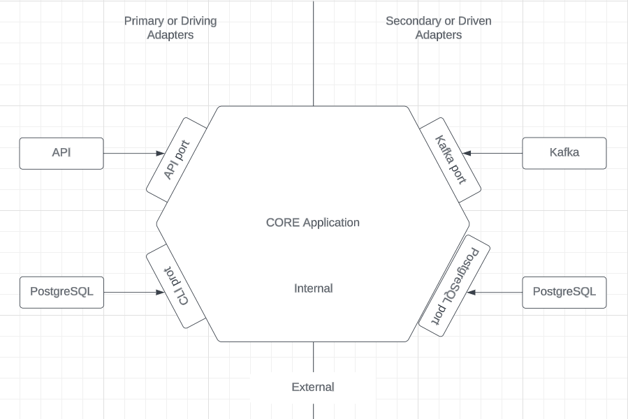
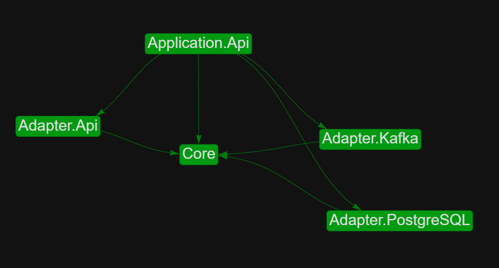

# Hexagonal Architecture (or port & adapters architecture)

> Clean Architecture and Onion Architecture are heavily inspired by Hexagonal architecture.

More information: [Hexagonal Architecture explained](https://www.youtube.com/watch?v=5ioLmkgJ_28&list=PL18L3lKMddFq-3f7DcSrqa_pTKfoh-D5h)

## Implementation of Hexagonal Architecture in .NET:

> Application.API serve as an entry point and to inject the dependencies. Like this it will not break Hexagonal Architecture concepts that adapters should not know each others (Adapter.API should not inject other adapters dependencies).

